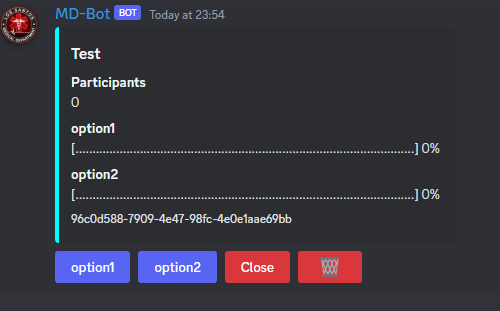
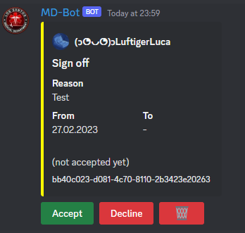
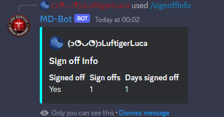
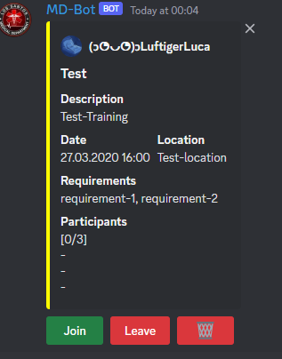
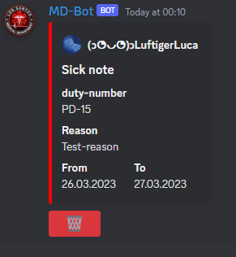
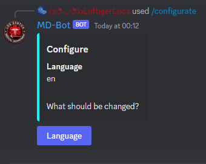

# MD-Discord-Bot

## Commands
| Command     | Options                                                          | Permission     | Desciption                            |
|-------------|------------------------------------------------------------------|----------------|---------------------------------------|
| info        |                                                                  |                | Shows the bot info                    |
| poll        | question, options                                                | createpoll     | Creates a poll with the given options |
| signoff     | reason, from, (to)                                               |                | Creates a signoff                     |
| signoffinfo | user                                                             | singoffinfo    | Shows the signoff info of the user    |
 | training    | name, date, description, location, requirements, maxparticipants | createtraining | Creates a training                    |
| sicknote    | person, reason, from, (to)                                       | createsicknote | Creates a sicknote                    |
| configurate |                                                                  | configurate    | Configurate the bot                   |
### Poll
The poll comand creates a poll with the given options. The options are seperated by a comma. The bot will add buttons to the message to vote for the options. A user can only vote once and for one option. The bot will update the message with the current votes.

<b>Buttons:</b>

| Button | Permission | Description                                                                         |
|--------|------------|-------------------------------------------------------------------------------------|
| Option |            | Vote for the option                                                                 |
| Close  | closepoll  | Closes the poll, the results still in the channel, but the users can't vote anymore |
| Delete | deletepoll | Deletes the poll and the results                                                    |

### Signoff
The signoff command creates a signoff for a defined time. The bot will save the signoff anonymously in a database. The bot also adds two buttons to the message to accept or decline the signoff. The bot will update the message with the current votes. When the signoff is accepted the embed will turn green, when the signoff is declined the embed will turn red.
<b>Options</b>

| Option | Description                                                    | Required |
|--------|----------------------------------------------------------------|----------|
| reason | The reason for the signoff                                     | Yes      |
| from   | The start date of the signoff the following format: dd.MM.yyyy | Yes      |
| to     | The end date of the signoff the following format: dd.MM.yyyy   | No       |

<b>Buttons:</b>

| Button  | Permission     | Description          |
|---------|----------------|----------------------|
| Accept  | acceptsignoff  | Accepts the signoff  |
| Decline | declinesignoff | Declines the signoff |
| Delete  | deletesignoff  | Deletes the signoff  |

### Signoffinfo
The signoffinfo command shows the signoff-status, the amount of signoffs and the length of the signoffs of a user. The bot will show the signoffs of the user who executed the command, if no user is given. The bot will show the signoffs of the given user, if a user is given. The message the bot send is only visible for the user who executed the command.

### Training
The training command creates a training with the given options. The bot will send a message with added buttons, to join or leave the training.

<b>Options</b>

| Option          | Description                                                        | Required |
|-----------------|--------------------------------------------------------------------|----------|
 | name            | The name of the training                                           | Yes      |
| date            | The date of the training in the following format: dd.MM.yyyy hh:mm | Yes      |
| description     | The description of the training                                    | Yes      |
| location        | The location of the training                                       | Yes      |
| requirements    | The requirements for the training                                  | Yes      |
| maxparticipants | The maximum amount of participants as an integer                   | Yes      |#

<b>Buttons:</b>

| Button  | Permission      | Description          |
|---------|-----------------|----------------------|
| Join    |                 | Joins the training   |
| Leave   |                 | Leaves the training  |
| Delete  | deletetraining  | Deletes the training |

### Sicknote
The sicknote command creates a sicknote for a defined person, as example an police-officer and a definde time. 

<b>Options</b>

| Option | Description                                                        | Required |
|--------|--------------------------------------------------------------------|----------|
| person | The person who is sick as example: PD-15                           | Yes      |
| reason | The reason for the sicknote                                        | Yes      |
| from   | The start date of the sicknote in the following format: dd.MM.yyyy | Yes      |
| to     | The end date of the sicknote in the following format: dd.MM.yyyy   | No       |

<b>Buttons:</b>

| Button  | Permission      | Description          |
|---------|-----------------|----------------------|
| Delete  | deletesicknote  | Deletes the sicknote |

### Configurate
The configurate command is used to configurate the bot. The bot will send a message with added buttons, to configurate the bot.

